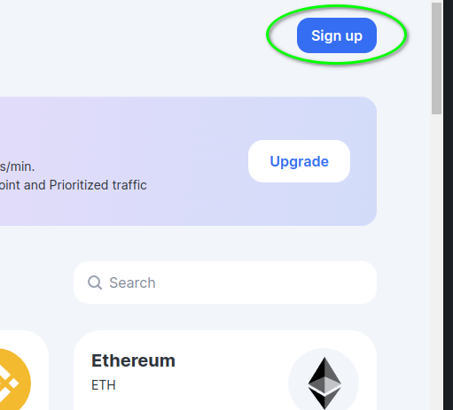
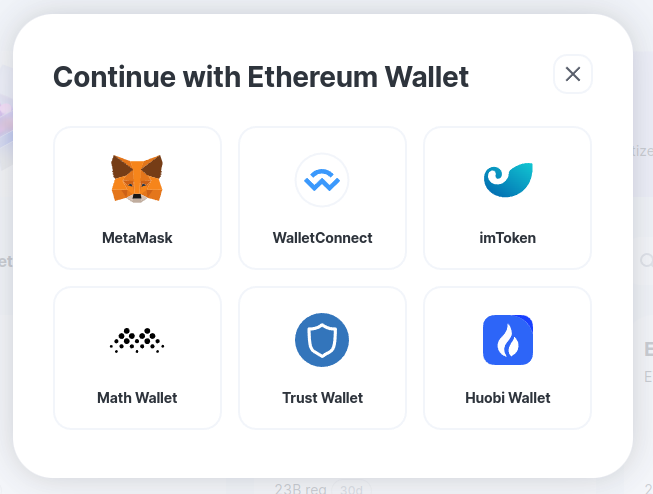
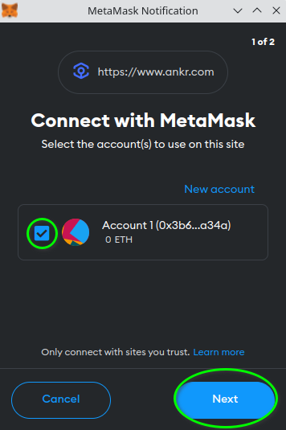
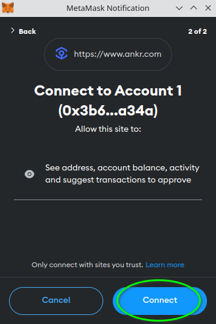
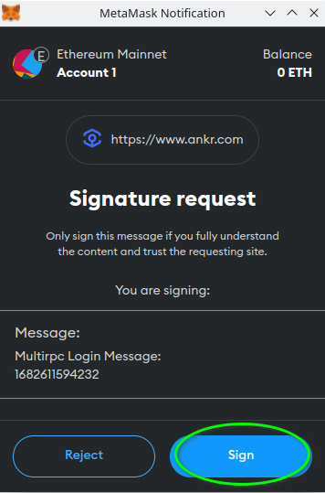
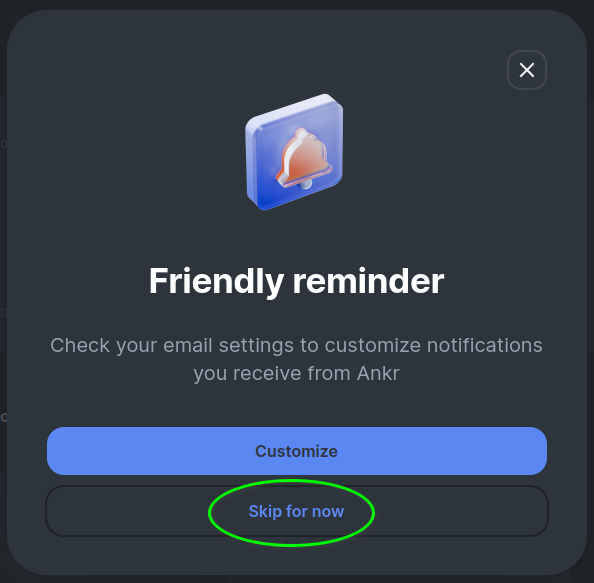
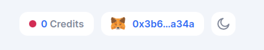
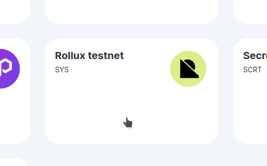
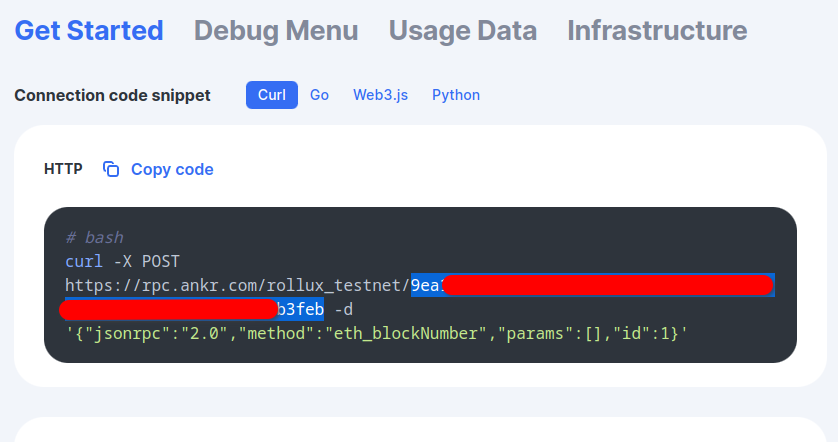

# Getting your API key from Ankr

This tutorial assumes you are completely new to Ankr, but that you want to get applications and API keys to use with Rollux.

## Register

The first step is to register for a free Ankr account.

1. Browse [to Ankr](https://www.ankr.com/rpc/) then click **Sign up**.

   

1. You can choose from two methods to sign up; Google or your ETH wallet. We recommend using your Ethereum wallet and this guide is based on that.

1. Select the wallet you are using. In this example we are using Metamask.

   

1. Now, within your wallet prompt, place a check beside the wallet account you wish to use wtih Ankr, then click **Next**.

   

1. If you're sure you selected the right account, click **Connect**.

   

1. Now sign to finish the process and connect to Ankr.com

   

1. If you see a reminder about enabling Ankr notifications, just skip it for now.

   

1. Once your Ankr account is ready and connected to your wallet, you will see the following account buttons at the top-right of the page.

   

1. Now scroll through the different networks available and select the one you want. In this example we use **Rollux testnet**.   

   

1. On the Rollux testnet page, scroll down to the Get Started area. Here you will see your API key as the portion highlighted in blue in the image below. Copy this and save it for future use.   

  